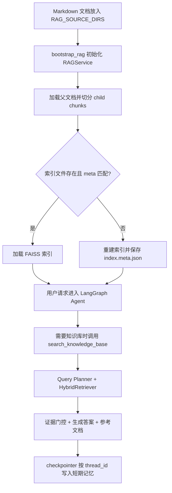

# imchat：带 RAG 与 LangGraph 记忆的对话系统

`imchat` 是一个 Python 对话应用，支持 CLI 与 Web 两个入口。  
当前默认运行时为 `LangGraph`，并保留 `LangChain` 作为回退路径。

## 当前能力

- 双运行时：`LangGraph`（默认）+ `LangChain`（fallback）
- 工具调用：`search_knowledge_base`、`get_current_time`、`calculate`
- RAG 全链路：文档扫描 -> 切分 -> FAISS 索引 -> 混合检索 -> 证据门控 -> 引用输出
- 防“知识库型幻觉”：未调用 KB 工具时禁止冒充知识库答案
- LangGraph 原生短期记忆：`checkpointer + thread_id(session_id)`
- Web API：同步 + SSE 流式

## 技术栈

- Python 3.10+
- Agent/LLM：`langgraph`、`langchain`、`langchain-openai`
- Web：`fastapi`、`uvicorn`
- 配置：`python-dotenv`
- RAG：`faiss-cpu`、`langchain-community`、`rank_bm25`

## 核心流程



## 目录结构

```text
src/
├─ actions/        # 工具定义（KB/时间/计算）
├─ agents/         # 运行时分流
├─ graphs/         # LangGraph 组装（含 checkpointer）
├─ rag/            # RAG 主流程（加载/切分/索引/检索/生成）
├─ prompts/        # 系统提示词与 KB 约束
├─ config/         # 配置加载
├─ web/            # FastAPI 接口
└─ main.py         # CLI 入口
docs/
└─ kb-end-to-end-tech-flow.md
```

## 快速开始

### 1) 安装依赖

```bash
python -m venv .venv
source .venv/bin/activate
pip install -r requirements.txt
```

### 2) 创建 `.env`

项目当前未提供 `.env.example`，请在仓库根目录手动创建 `.env`，最少包含：

```env
OPENAI_API_KEY=your_api_key
OPENAI_MODEL=qwen-plus
OPENAI_BASE_URL=https://dashscope.aliyuncs.com/compatible-mode/v1

AGENT_RUNTIME=langgraph
AGENT_STREAMING=true
AGENT_USE_LANGGRAPH_MEMORY=true
AGENT_VERBOSE=false

RAG_ENABLED=true
RAG_SOURCE_DIRS=/absolute/path/to/your/markdown/dir
RAG_INDEX_DIR=data/rag_index
```

### 3) 启动

CLI：

```bash
python src/main.py
```

Web：

```bash
uvicorn web.app:app --app-dir src --reload
```

访问：`http://127.0.0.1:8000`

## 配置说明（重点）

运行时相关：

- `AGENT_RUNTIME`：`langgraph` / `langchain`
- `AGENT_STREAMING`：是否启用流式返回
- `AGENT_USE_LANGGRAPH_MEMORY`：LangGraph 记忆开关（默认 `true`）
- `AGENT_VERBOSE`：调试日志

RAG 必要项：

- `RAG_ENABLED`：是否启用 RAG
- `RAG_SOURCE_DIRS`：逗号分隔的 markdown 根目录
- `RAG_INDEX_DIR`：FAISS 索引目录
- `RAG_REBUILD`：`true` 时强制重建索引

RAG 召回/排序可调项：

- `RAG_TOP_K`、`RAG_RETRIEVAL_K`、`RAG_RRF_K`
- `RAG_RERANK_ENABLED` 及相关 `RAG_RERANK_*`
- `RAG_QUERY_PLAN_*`（query planner 模型、超时、变体数）

> 已废弃并移除：`RAG_FORCE_TOOL_ROUTE`、`RAG_FORCE_TOOL_POLISH`

## Web API

- `POST /api/chat`：同步返回
- `POST /api/chat/stream`：SSE 流式返回
  - `chunk`：`{"text":"..."}`
  - `done`：`{"answer":"..."}`
  - `error`：`{"detail":"..."}`
- `POST /api/reset`：兼容接口（当前建议通过更换 `session_id` 进行“重置会话”）
- `GET /health`：运行健康与 RAG 启动状态

## 运行机制补充

- `search_knowledge_base` 在 `src/actions/knowledge_base_tools.py` 中返回结构化 payload；
- `bootstrap_rag` 成功后会将 `RAGService` 绑定到工具层；
- `src/web/app.py` / `src/main.py` 均以 `thread_id=session_id` 调用 agent；
- `src/graphs/dialog_graph.py` 使用 `MemorySaver` 作为 checkpointer（进程内记忆，重启丢失）。

## 常见问题

- `Missing OPENAI_API_KEY`：确认 `.env` 在仓库根目录，且变量名正确。
- RAG 未生效：检查 `RAG_ENABLED=true`、`RAG_SOURCE_DIRS` 是否可读、启动日志中 `bootstrap_rag` 状态。
- 有文档但检索不到：检查索引目录下 `index.meta.json` 是否与当前数据/配置一致；必要时设置 `RAG_REBUILD=true` 重建。
- 回答声称“根据知识库”但不可信：查看日志里是否存在 `search_knowledge_base` tool call；系统已内置未调用时的防幻觉降级处理。
