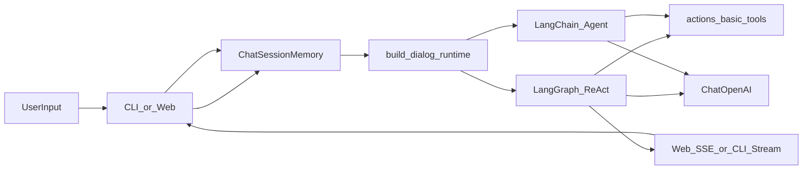

# imchat：LangGraph/LangChain 双运行时对话项目

`imchat` 是一个 Python 对话应用，支持 CLI 与 Web 两种入口，当前以 `LangGraph` 为默认运行时，并保留 `LangChain` 回退能力。

## 当前能力概览

- 双运行时：`LangGraph`（默认）与 `LangChain`（兼容回退）
- 多轮会话记忆：基于 `langchain_core.messages` 的内存消息列表
- 工具调用：当前时间、数学表达式计算
- Web 对话接口：同步接口 + SSE 流式接口
- 可扩展 RAG 模块：`src/rag/*` 已具备独立实现与冒烟脚本

## 技术栈

- Python 3.10+
- LLM 框架：`langgraph`、`langchain`、`langchain-openai`
- Web：`FastAPI` + `uvicorn`
- 配置：`python-dotenv`
- RAG（模块级）：`langchain-community`、`faiss-cpu`、`rank_bm25`

## 架构与数据流



## 目录结构（按职责）

```text
imchat/
├─ src/
│  ├─ actions/           # 工具定义（time/calculate）
│  ├─ agents/            # 运行时分流与 Agent 组装
│  ├─ graphs/            # LangGraph 组装
│  ├─ llms/              # 模型初始化（ChatOpenAI）
│  ├─ memory/            # 会话记忆（BaseMessage）
│  ├─ config/            # 配置与日志
│  ├─ rag/               # RAG 模块实现
│  ├─ tests/             # 冒烟脚本
│  ├─ main.py            # CLI 入口
│  └─ web/               # FastAPI 与静态页面
├─ docs/                 # 设计与实施文档
├─ .env.example
├─ requirements.txt
└─ README.md
```

## 运行前准备

### 1) 安装依赖

```bash
python -m venv .venv
.venv\Scripts\activate
pip install -r requirements.txt
```

### 2) 配置环境变量

复制 `.env.example` 为 `.env`，至少配置：

```env
OPENAI_API_KEY=your_api_key
OPENAI_MODEL=qwen-plus
OPENAI_BASE_URL=https://dashscope.aliyuncs.com/compatible-mode/v1

AGENT_RUNTIME=langgraph
AGENT_STREAMING=true
AGENT_VERBOSE=false
```

常用开关：

- `AGENT_RUNTIME`：`langgraph` 或 `langchain`
- `AGENT_STREAMING`：是否启用流式（CLI + Web 流式路径）
- `LOG_LEVEL`：日志级别（`DEBUG/INFO/WARNING/ERROR`）

## 启动方式

### CLI

```bash
python src/main.py
```

### Web

```bash
uvicorn web.app:app --app-dir src --reload
```

打开浏览器：`http://127.0.0.1:8000`

## Web API

- `POST /api/chat`：同步返回完整答案
- `POST /api/chat/stream`：SSE 流式返回（`chunk/done/error` 事件）
- `POST /api/reset`：按 `session_id` 清空会话历史

## 工具与运行时说明

- 工具定义在 `src/actions/basic_tools.py`
  - `get_current_time`
  - `calculate`
- 运行时分流在 `src/agents/dialog_agent.py`
  - `AGENT_RUNTIME=langgraph`：优先 `src/graphs/dialog_graph.py`
  - LangGraph 初始化失败时自动回退 `LangChain`

## RAG 状态说明（重要）

`src/rag/*` 模块和相关 `tmp_step*.py` 脚本已存在，但**当前默认工具列表尚未挂载 RAG 检索工具**。  
也就是说，当前线上对话链路默认使用的是基础工具（时间/计算）。若要启用 RAG，需要继续接入 `search_knowledge_base` 到工具层与启动链路。

## 冒烟脚本

- `src/tests/tmp_langgraph_smoke.py`：运行时基础冒烟
- `src/tests/tmp_step1_smoke.py` ~ `tmp_step4_smoke.py`：RAG 分阶段冒烟
- `src/tests/tmp_validate_kungpao.py`：RAG 检索命中验证

## 常见问题

- 启动时报 `Missing OPENAI_API_KEY`：检查 `.env` 是否在项目根目录且变量名正确。
- Web 没有流式效果：确认 `AGENT_RUNTIME=langgraph` 且 `AGENT_STREAMING=true`。
- 模型请求失败：优先检查 `OPENAI_BASE_URL`、代理网络、以及 API Key 可用性。
