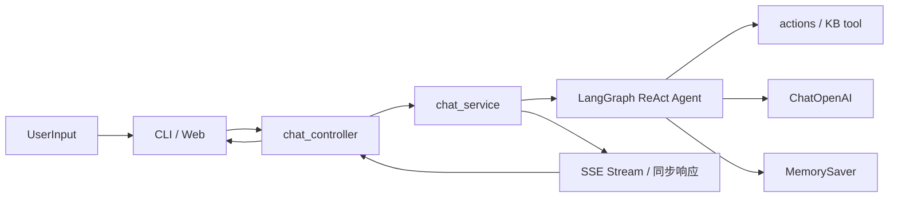

# imchat：LangGraph/LangChain 双运行时对话项目

`imchat` 是一个 Python 对话应用，支持 CLI 与 Web 两种入口，当前以 `LangGraph` 为默认运行时，并保留 `LangChain` 回退能力。

## 当前能力概览

- 双运行时：`LangGraph`（默认）与 `LangChain`（兼容回退）
- 多轮会话记忆：基于 LangGraph `MemorySaver` checkpointer，按 `thread_id`/`session_id` 自动持久化
- 工具调用：当前时间、数学表达式计算
- Web 对话接口：同步接口 + SSE 流式接口
- 知识库 RAG：`search_knowledge_base` 工具，包含幻觉防护（`sanitize_ungrounded_kb_claim`）
- Controller / Service 分层架构：路由、业务逻辑、应用初始化各司其职

## 技术栈

- Python 3.10+
- LLM 框架：`langgraph`、`langchain`、`langchain-openai`
- Web：`FastAPI` + `uvicorn`
- 配置：`python-dotenv`
- RAG（模块级）：`langchain-community`、`faiss-cpu`、`rank_bm25`

## 架构与数据流



## 目录结构（按职责）

```text
imchat/
├─ src/
│  ├─ actions/           # 工具定义（time / calculate / search_knowledge_base）
│  ├─ agents/            # 运行时分流与 Agent 组装
│  ├─ graphs/            # LangGraph 图组装（含 MemorySaver）
│  ├─ llms/              # 模型初始化（ChatOpenAI）
│  ├─ config/            # 配置（Settings）与日志
│  ├─ controllers/       # HTTP 路由层（chat_controller / system_controller）
│  ├─ services/          # 业务逻辑层（chat_service：invoke / stream / 幻觉防护）
│  ├─ prompts/           # 系统提示词
│  ├─ rag/               # RAG 模块（检索 / 分块 / 重排 / 路由）
│  ├─ tests/             # 冒烟脚本
│  ├─ main.py            # CLI 入口
│  └─ web/
│     ├─ app.py          # FastAPI 应用初始化 + 路由挂载
│     └─ static/         # 前端页面
├─ docs/                 # 设计与实施文档
├─ .env.example
├─ requirements.txt
└─ README.md
```

## 运行前准备

### 1) 安装依赖

```bash
python -m venv .venv
source .venv/bin/activate   # Windows: .venv\Scripts\activate
pip install -r requirements.txt
```

### 2) 配置环境变量

复制 `.env.example` 为 `.env`，至少配置：

```env
OPENAI_API_KEY=your_api_key
OPENAI_MODEL=qwen-plus
OPENAI_BASE_URL=https://dashscope.aliyuncs.com/compatible-mode/v1

AGENT_RUNTIME=langgraph
AGENT_STREAMING=true
AGENT_VERBOSE=false
```

常用开关：

- `AGENT_RUNTIME`：`langgraph` 或 `langchain`
- `AGENT_STREAMING`：是否启用流式（CLI + Web 流式路径）
- `AGENT_USE_LANGGRAPH_MEMORY`：是否启用 LangGraph 原生记忆（默认 `true`）
- `RAG_ENABLED`：是否启用知识库 RAG（默认 `false`）
- `LOG_LEVEL`：日志级别（`DEBUG/INFO/WARNING/ERROR`）

## 启动方式

### CLI

```bash
python src/main.py
```

### Web

```bash
uvicorn web.app:app --app-dir src --reload
```

打开浏览器：`http://127.0.0.1:8000`

## Web API

| 方法 | 路径 | 说明 |
|------|------|------|
| `GET` | `/` | 前端页面 |
| `GET` | `/health` | 健康检查（含 RAG 状态、运行时信息） |
| `POST` | `/api/chat` | 同步返回完整答案 |
| `POST` | `/api/chat/stream` | SSE 流式返回 |
| `POST` | `/api/reset` | 按 `session_id` 重置会话 |

SSE 事件类型：
- `chunk`：增量文本片段（`{"text": "..."}`）
- `done`：最终答案（`{"answer": "..."}`）
- `error`：错误信息（`{"detail": "..."}`）

请求体格式（`/api/chat`、`/api/chat/stream`）：
```json
{ "session_id": "xxx", "message": "你好" }
```

## 工具与运行时说明

- 工具定义在 `src/actions/basic_tools.py`
  - `get_current_time`
  - `calculate`
  - `search_knowledge_base`（RAG 启用时生效）
- 运行时分流在 `src/agents/dialog_agent.py`
  - `AGENT_RUNTIME=langgraph`：优先 `src/graphs/dialog_graph.py`
  - LangGraph 初始化失败时自动回退 `LangChain`

## 代码分层说明

| 层 | 文件 | 职责 |
|---|---|---|
| **App** | `web/app.py` | 创建 FastAPI 实例、初始化 settings/agent、注入 service/controller、RAG 启动 |
| **Controller** | `controllers/chat_controller.py` | 请求校验、调用 service、返回响应 |
| **Controller** | `controllers/system_controller.py` | `/health`、`/` 静态页面 |
| **Service** | `services/chat_service.py` | invoke/stream、工具日志、幻觉防护、SSE 格式化 |

## RAG 状态说明

`src/rag/*` 模块已具备完整实现，工具层挂载 `search_knowledge_base`。
RAG 是否实际可用取决于启动阶段 `bootstrap_rag` 是否成功，以及 `RAG_ENABLED` 配置。

- `RAG_ENABLED=false`：`search_knowledge_base` 会返回"知识检索服务未初始化"降级文案
- `RAG_ENABLED=true` 且配置正确：工具返回 `answer + sources`
- 幻觉防护：未调用 KB 工具却出现"知识库引用"话术时，自动标记为通用建议

## 冒烟脚本

- `src/tests/tmp_langgraph_smoke.py`：运行时基础冒烟
- `src/tests/tmp_step1_smoke.py` ~ `tmp_step4_smoke.py`：RAG 分阶段冒烟
- `src/tests/tmp_validate_kungpao.py`：RAG 检索命中验证

## 常见问题

- 启动时报 `Missing OPENAI_API_KEY`：检查 `.env` 是否在项目根目录且变量名正确。
- Web 没有流式效果：确认 `AGENT_RUNTIME=langgraph` 且 `AGENT_STREAMING=true`。
- 模型请求失败：优先检查 `OPENAI_BASE_URL`、代理网络、以及 API Key 可用性。
- RAG 启动失败：查看启动日志中 `rag_bootstrap_failed` 的 reason 字段。
