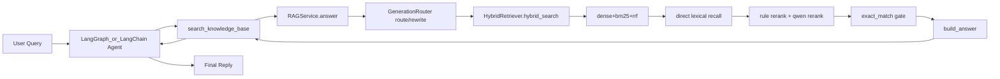

# RAG 当前技术流程梳理（基于现有代码）

本文档按当前仓库代码实现整理（`src/rag/*`、`src/actions/basic_tools.py`、`src/main.py`、`src/web/app.py`），用于说明知识库文档的上传/加载、分割、向量构建与检索回答的实际链路。

---

## 1. 全链路概览

---

## 2. 配置与启动入口

## 2.1 配置读取

- 文件：`src/config/settings.py`
- 关键项：
  - `RAG_ENABLED`
  - `RAG_SOURCE_DIRS`（CSV）
  - `RAG_INDEX_DIR`
  - `RAG_TOP_K` / `RAG_RETRIEVAL_K` / `RAG_RRF_K`
  - `RAG_*_EMBEDDING_*`
  - `RAG_RERANK_*`

`RAG_SOURCE_DIRS` 会经过 `_normalize_paths()` 归一化为绝对路径，因此 `.env` 里的路径必须在当前机器可达。

## 2.2 启动注入

- 文件：`src/rag/bootstrap.py`
- 入口：
  - CLI：`src/main.py`
  - Web：`src/web/app.py`

流程：

1. `build_rag_config(settings)`  
2. `sanitize_rag_config(cfg)`  
3. `validate_rag_config(cfg)`  
4. `service = RAGService(cfg)`  
5. `service.initialize(force_rebuild=cfg.rebuild)`  
6. `set_rag_service(service)` 注入工具层

若异常会返回 `init_error:*`，工具调用仍可继续，但会走降级路径。

---

## 3. 文档上传/加载流程（当前实现语义）

## 3.1 数据来源

- 文件：`src/rag/data_loader.py`
- 当前实现是“本地目录扫描加载”，不是在线上传接口。
- 可理解为“上传后落本地目录，再由 loader 扫描”。

## 3.2 扫描与读取

`MarkdownDataLoader.scan_markdown_files()`：

- 遍历 `source_dirs`
- 对每个目录递归 `rglob("*.md")`
- 去重（按绝对路径）
- 排序后输出

`MarkdownDataLoader.load_documents()`：

- 逐个读取 UTF-8 文本
- 空文档跳过
- 生成 parent `Document`

## 3.3 Parent 元数据

`_build_parent_metadata()` 生成：

- `source`：绝对路径
- `title`：首个一级标题（回退文件名）
- `category`
- `parent_id`（UUID）
- `doc_type=parent`

---

## 4. 分割流程（Parent -> Child）

- 文件：`src/rag/chunking.py`
- 类：`ParentChildChunker`

流程：

1. 先按 `# / ## / ###` 标题分段
2. 每段按 `chunk_size/chunk_overlap` 做长度切分
3. 生成 child 文档与映射

输出三件套：

- `children: list[Document]`
- `parent_map: dict[parent_id, parent_doc]`
- `child_parent: dict[child_id, parent_id]`

Child 元数据包含：

- `child_id`
- `parent_id`
- `chunk_index`
- `doc_type=child`
- `chunk_size`

---

## 5. 向量索引构建与加载

- 文件：`src/rag/index_store.py`
- 类：`LocalFAISSIndexStore`

## 5.1 Embedding 与向量库

- Embedding：`OpenAIEmbeddings`（兼容 DashScope）
- Vector DB：`FAISS`

## 5.2 构建路径

`build(children)`：

- `FAISS.from_documents(children, embeddings)`

`save()`：

- 存盘 `index.faiss/index.pkl`
- 同时写 `index.meta.json`（签名）

## 5.3 加载路径

`load(expected_children_count)`：

- 校验索引文件存在
- 校验 meta 签名（source_dirs、embedding_model、dimensions、chunk参数、children_count）
- 匹配成功才加载，否则返回 `False` 触发重建

---

## 6. 检索流程（核心）

- 文件：`src/rag/retriever.py`
- 类：`HybridRetriever`

## 6.1 Query expansion

`_expand_queries(query)`：

- 生成多变体 query（原 query + 清洗版 + “做法/教程/是什么”变体）

## 6.2 双路召回

对每个 variant：

- `vector_search()`
- `bm25_search()`（带 `_tokenize_for_sparse`）

随后合并并通过 `rrf_fuse()` 融合。

## 6.3 Parent 回填与扩召回

- `child_to_parent()` 将 child 命中映射到 parent
- `_direct_parent_lexical_recall()` 在 title/source/content 做词面直达召回
- `_merge_unique_parents()` 合并去重候选池

## 6.4 重排

1. `_rerank_parents_by_query()` 规则重排  
2. `_rerank_parents_by_qwen()` 模型重排（可开关）

## 6.5 关键命中信号

`_compute_exact_match_hit()` 输出 `exact_match_hit`：

- 用于区分“精确命中”与“仅弱相关命中”

## 6.6 Debug 输出字段（关键）

`RetrievalResult.debug` 目前包含：

- `variant_queries`
- `direct_hit_count`
- `direct_hit_titles`
- `exact_match_hit`
- `candidate_parent_count_before_trim`
- `top_titles_before_rerank` / `top_titles`
- `qwen_rerank_called` / `qwen_rerank_ok` / `qwen_rerank_error`

---

## 7. 回答生成与低置信度门控

- 文件：`src/rag/service.py`
- 路径：`RAGService.answer()`

流程：

1. `route = router.route_query(query)`
2. `rewritten = router.rewrite_query(query, route)`
3. `ret = retrieve(rewritten)`
4. 低置信度门控：
   - 若 `route == detail` 且 `exact_match_hit == False`
   - 返回“未精确命中”说明 + 参考来源（避免幻觉步骤）
5. 否则 `router.build_answer(...)` 正常生成

门控信息会在 `debug` 里写入：

- `low_confidence_blocked=True/False`

---

## 8. Agent 工具层对接

- 文件：`src/actions/basic_tools.py`
- 工具：`search_knowledge_base`

行为：

- 接收用户原始 query
- 调 `RAGService.answer()`
- 返回结构化 JSON 字符串（`ok/answer/sources/citations/error/debug`）

Agent 提示词会约束：

- 优先调用 `search_knowledge_base`
- 未命中时要明确“知识库未精确命中”
- 可给“非知识库兜底建议”，但不可伪造引用

---

## 9. 运行期可观测日志

当前可重点关注：

- `rag_bootstrap_failed` / `RAG ready`
- `[RETRIEVE_DEBUG]`（召回与命中信号）
- `[ANSWER_GUARD]`（是否触发低置信度门控）
- `[TOOL_KB_DEBUG]`（工具层透出的 debug 关键信号）

若出现“工具被调用但总是未命中”，优先检查：

1. `RAG_SOURCE_DIRS` 是否为当前机器有效路径  
2. `faiss-cpu` 与 embedding 依赖是否可用  
3. 启动日志是否存在 bootstrap 失败  
4. `exact_match_hit` 与 `direct_hit_titles` 是否合理

---

## 10. 当前流程边界

- 当前是“本地目录型知识库”，不含独立上传 API/任务队列
- 增量更新通过“重启 + load/build 索引”完成
- 回答生成为规则化拼接，未引入专门生成模型链路

如需进一步产品化，建议下一步引入：

- 文档上传 API + 异步索引任务
- 增量索引与版本管理
- 检索质量评估集与自动回归

