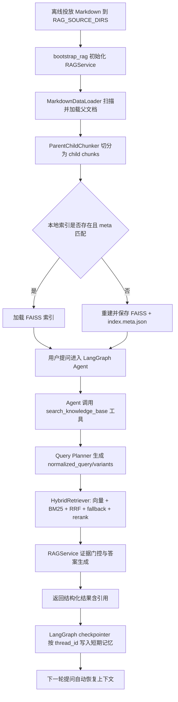

# 知识库问答技术流程梳理（含问题复盘）

## 1. 需求

本项目知识库问答的目标可拆成 3 层：

1. **可用性**：用户提出菜谱/文档类问题时，Agent 能稳定调用知识库并返回可追溯答案；
2. **可信性**：答案必须绑定真实检索结果，不能出现“看起来像知识库答案但其实是幻觉”的情况；
3. **连续对话能力**：知识库问答要纳入同一会话短期记忆，支持追问、省略指代、回看上文。

对应的核心流程要求：

- 文档数据可被稳定加载与切分；
- 索引可校验、可重建，避免“有文件但检索不到”；
- Query 具备泛化处理能力，提升召回；
- 生成前有证据门控；
- Web/CLI 都使用 LangGraph 原生 short-term memory（thread_id + checkpointer）。

---

## 2. 技术框架

## 2.1 运行时框架

- Agent 框架：LangGraph（默认）+ LangChain（fallback）
  - 运行时选择：`src/agents/dialog_agent.py`
  - Graph 构建：`src/graphs/dialog_graph.py`

## 2.2 工具层

- 工具注册：`src/actions/basic_tools.py`
  - `search_knowledge_base`
  - `get_current_time`
  - `calculate`
- KB 工具实现：`src/actions/knowledge_base_tools.py`
  - 对外统一返回结构化 JSON payload（含 `ok/answer/sources/citations/debug/error`）

## 2.3 RAG 主体

- 启动绑定：`src/rag/bootstrap.py`
  - 初始化 `RAGService`
  - 调用 `set_rag_service(...)` 注入工具
- 数据加载：`src/rag/data_loader.py`
- 文档切分：`src/rag/chunking.py`
- 索引生命周期：`src/rag/index_store.py`（FAISS + meta 签名）
- 检索与融合：`src/rag/retriever.py`（向量 + BM25 + RRF + fallback + 可选 rerank）
- Query 规划：`src/rag/query_planner.py`（LLM 规划 + fallback 归一化）
- 生成与门控：`src/rag/service.py` + `src/rag/generation_router.py`

## 2.4 记忆层

- Graph 级记忆：`MemorySaver` checkpointer（`src/graphs/dialog_graph.py`）
- 会话键：`thread_id=session_id`（`src/web/app.py`、`src/main.py`）

---

## 3. 技术流程

下面按“文档上传/入库 -> 检索 -> 生成 -> 记忆”描述全链路。

## 3.1 文档上传（当前实现形态）

当前不是 HTTP 上传接口，而是**离线文件投放 + 配置目录扫描**：

1. 将 markdown 文档放入 `RAG_SOURCE_DIRS` 对应目录；
2. 服务启动时触发 `bootstrap_rag(...)`（`src/web/app.py` startup、`src/main.py`）；
3. `MarkdownDataLoader.scan_markdown_files(...)` 递归扫描 `*.md` 并去重；
4. `load_documents(...)` 读文件内容，构建 parent 文档元数据（`source/title/category/parent_id`）。

## 3.2 文档分割

`ParentChildChunker.build_parent_child(...)` 执行 parent-child 切分：

1. 先按 markdown 标题切段（`# / ## / ###`）；
2. 超长段按 `chunk_size/chunk_overlap` 二次切片；
3. 为每个 child 生成 `child_id/parent_id/chunk_index`；
4. 同步构建 `parent_map` 与 `child_parent` 映射供后续检索回溯。

## 3.3 构建/加载索引

`RAGService.initialize(...)` 中：

1. 先尝试加载已存在 FAISS 索引；
2. 加载前强制做 meta 签名校验（`source_dirs/embedding_model/dim/chunk/children_count`）；
3. 校验通过才 `load_local(...)`；
4. 否则自动 `build(...) + save(...)` 重建索引；
5. 保存时同时写 `index.meta.json`。

这一步保证了“索引与当前文档状态一致”。

## 3.4 检索

请求到达 `search_knowledge_base` 工具后：

1. `RAGService.answer(query)` 调用路由与改写；
2. `retrieve(...)` 内可选调用 `LLMQueryPlanner.plan(...)` 输出 `normalized_query/core_terms/query_variants`；
3. `HybridRetriever.hybrid_search(...)` 对 variants 并行做：
   - 向量检索（FAISS）
   - BM25 检索
4. 使用 RRF 融合子块排序；
5. child -> parent 映射；
6. fallback 词法召回补齐；
7. 可选 Qwen rerank 重排父文档；
8. 输出 `parents/sources/debug`。

## 3.5 生成答案

`RAGService.answer(...)` 里做“检索结果 -> 最终答案”：

1. 从 `debug` 里计算证据强度（`confidence_score/is_confident/direct_hit/semantic_overlap`）；
2. detail 场景若证据不足，返回 `build_blocked_answer(...)`，避免低质量硬答；
3. 证据通过时，`GenerationRouter.build_answer(...)` 生成正文并附上参考文档列表；
4. 工具层将结果包装为统一 JSON payload 返回 Agent。

## 3.6 短期记忆（LangGraph 原生）

1. Graph 构建时注入 `MemorySaver` checkpointer；
2. Web/CLI 调用 agent 时统一传 `config={"configurable":{"thread_id": session_id}}`；
3. 每轮只传当前用户消息，历史由 checkpointer 自动恢复；
4. reset 通过切换新 `session_id` 实现会话重置。

---

## 4. 遇到的问题及解决办法

## 问题1：索引“坏掉”，有原始文件但检索不到

**现象**  
文件在目录里，但检索无命中或命中异常，原因是旧索引与当前数据形态不一致。

**根因**  
仅判断 `index.faiss/index.pkl` 是否存在，不足以证明索引和当前文档配置一致。

**解决方案（已落地）**

- 在 `src/rag/index_store.py` 增加索引签名机制：
  - `_build_signature(...)`
  - `_save_meta(...)` / `_load_meta(...)`
  - `_is_meta_match(...)`
- 在 `RAGService.initialize(...)` 加载时传 `expected_children_count` 进行强校验；
- mismatch 自动重建索引，并通过 `stats`/日志暴露 `index_loaded/index_rebuilt/index_meta_reason`。

**效果**  
从“文件存在但检索不到”的隐性故障，转为“可检测、可自动重建”的显性可恢复状态。

---

## 问题2：Query 早期硬编码，泛化差，向量匹配弱

**现象**  
用户措辞变化后命中率明显下降，检索过度依赖固定关键词规则。

**根因**  
query 预处理过于模板化，缺乏实体提取、变体扩展和容错策略。

**解决方案（已落地）**

- 引入 `LLMQueryPlanner`（`src/rag/query_planner.py`）：
  - 输出 `normalized_query/core_terms/query_variants/intent_hint/entities/constraints/confidence`
  - 对结构化结果做 sanitize 和兜底
- 在 `HybridRetriever.hybrid_search(...)` 中消费 query variants；
- 加入 fallback 词法召回（`_fallback_parent_recall`）；
- 结合向量 + BM25 + RRF + rerank，形成多路召回。

**效果**  
检索从“单问句直搜”升级为“多变体 + 混合召回”，显著提升了泛化命中率。

---

## 问题3：知识库型幻觉（未调用工具却伪造来源）

**现象**  
模型给出“参考文档路径”，但实际没有调用 `search_knowledge_base`，路径是编造的。

**根因**  
纯提示词约束不够，缺少运行时校验与结果后处理。

**解决方案（已落地）**

1. **提示词约束**（`src/prompts/knowledge_base_prompt.py` + `src/prompts/system_prompts.py`）  
   明确：未调用工具禁止使用“根据知识库/参考文档”等表述。

2. **工具化输出**（`src/actions/knowledge_base_tools.py`）  
   KB 返回结构化 payload，引用来源来自检索结果而非模型自由发挥。

3. **运行时防护**（`src/web/app.py`）  
   `_sanitize_ungrounded_kb_claim(...)` 检测到“未调用 KB 工具却出现知识库话术”时，降级为“通用建议”并移除伪造引用区块。

**效果**  
把“隐式幻觉”转为“可识别并可降级”的安全策略，显著降低伪来源输出。

---

## 问题4：知识库问答没接入 LangGraph 短期记忆

**现象**  
问完知识库再追问“我刚才问了什么”，模型像失忆。

**根因（历史）**  
知识库路径曾存在 Web 层旁路，不是统一 Agent 回合；且会话状态非 graph 原生。

**解决方案（已落地）**

- 统一链路：去除 Web 侧 forced-route 旁路；
- `create_react_agent(..., checkpointer=MemorySaver())`；
- Web/CLI 调用统一传 `thread_id=session_id`；
- 移除本地 `ChatSessionMemory` 双状态源，避免冲突与重复上下文。

**效果**  
知识库问答与普通对话进入同一会话状态机，支持跨轮追问和“回看上文”。

---

## 5. 后续计划（概览）

## 5.1 接入 PostgreSQL

- 目标：把会话状态、文档元数据、任务日志统一持久化；
- 建议：
  - 记忆层从 `MemorySaver` 升级为持久化 checkpointer（如 PG/SQL 实现）；
  - RAG 元数据（文档版本、索引版本、构建批次）入库；
  - 建立“索引版本 -> 可回滚”机制。

## 5.2 构建多模态知识库

- 目标：支持文本 + 图片 + 表格（后续可扩展音视频）；
- 建议：
  - 增加多模态解析 pipeline（OCR/图像描述/结构化抽取）；
  - 采用“多向量字段 + 统一检索编排”；
  - 结果层保留模态来源（文本段落、图片区域、表格单元）用于可追溯引用。

## 5.3 构建多 Agent 协同

- 目标：从单 ReAct 升级为“规划-检索-生成-校验”协作；
- 建议：
  - Planner Agent：意图拆解与查询计划；
  - Retriever Agent：多路检索与证据聚合；
  - Answer Agent：答案生成；
  - Verifier Agent：来源核验与幻觉拦截；
  - 通过 LangGraph 子图编排并沉淀可观测指标（召回率、命中率、拒答率、幻觉拦截率）。

