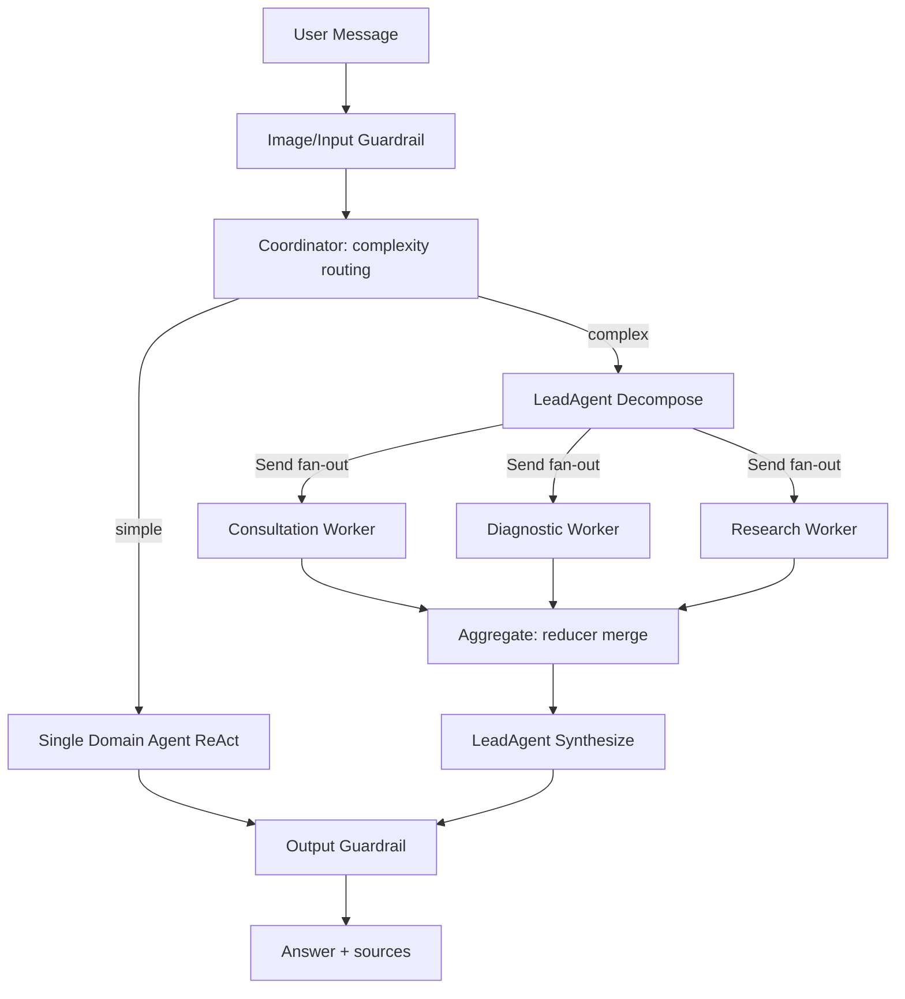

交付物：本计划将落地为 `docs/medix化改造计划.md`（确认后切到 Agent 模式写入）。

## 1. 目标与范围（已确认）

- 范围：core 优先 —— 结构化 Skill 注册表 + Swarm（分解/并行/汇总）+ 协调器路由；领域 Skill 先包装现有 `rag` / `web_search`。
- Swarm 实现：LangGraph 原生子图（`Send` map-reduce 扇出 + reducer 合并），复用现有 checkpointer/streaming/guardrails。
- 长期记忆：Mem0 云服务（作为后续阶段接入，不阻塞 core）。

## 2. 现状 vs 目标

现状关键文件：
- 运行时装配：[src/agents/dialog_agent.py](src/agents/dialog_agent.py) `build_dialog_runtime()`（langchain / langgraph / langgraph-multi）
- 多 Agent 图（supervisor 选一个专家）：[src/graphs/multi_agent_graph.py](src/graphs/multi_agent_graph.py)
- Agent 定义：[src/agents/agent_registry.py](src/agents/agent_registry.py)（`AgentDef`）
- Skill（prompt+工具名）：[src/prompts/skills/__init__.py](src/prompts/skills/__init__.py)（`SkillDef`）
- 工具：[src/actions/basic_tools.py](src/actions/basic_tools.py)、[src/actions/knowledge_base_tools.py](src/actions/knowledge_base_tools.py)、[src/actions/web_search_tools.py](src/actions/web_search_tools.py)
- RAG：[src/rag/core/service.py](src/rag/core/service.py)
- 服务/流式：[src/services/chat_service.py](src/services/chat_service.py)
- 配置：[src/config/settings.py](src/config/settings.py)

差距：
- Skill 仅是「prompt + tool 名映射」，缺结构化原子函数 + 参数 schema + 注册表。
- 多 Agent 是「路由选一个专家」，缺「分解 → 并行多 Agent → 汇总」。
- 缺领域 Agent（咨询/诊断/研究）与领域 Skill（风险/症状/ICD/指南）。
- 缺记忆分层（短期会话 + 长期跨会话）。

## 3. 目标架构

Skill 层映射：每个领域 Skill 是自包含函数（带参数 schema），底层调用现有 `RAGService` / `web_search` / 规则逻辑；注册表统一暴露为 LangChain `@tool`（供 ReAct）与 OpenAI function schema（供 LeadAgent 决策）。

## 4. 实施阶段

### Phase 0 基线与开关（小）
- 在 [src/config/settings.py](src/config/settings.py) 增加：`agent_mode` 支持 `swarm`；新增 `swarm_max_workers`、`swarm_timeout_s`、`complexity_threshold` 等。
- 在 [src/agents/dialog_agent.py](src/agents/dialog_agent.py) `build_dialog_runtime()` 增加 `langgraph-swarm` 运行时分支（默认回退到现有 multi/single，保证向后兼容）。

### Phase 1 结构化 Skill 注册表（核心，中）
- 新增 `src/skills/base.py`：`Skill`（name、description、参数 schema、`run()`）+ `SkillParameter`，参考 medix `core/skill_registry.py` 的 `to_openai_format()`。
- 新增 `src/skills/registry.py`：注册/获取/转 OpenAI schema/转 LangChain `@tool`（用 `StructuredTool.from_function`）。
- 领域 Skill（先复用现有能力，不重造）：
  - `search_knowledge` 包装 `RAGService.answer()`（[src/actions/knowledge_base_tools.py](src/actions/knowledge_base_tools.py) 的逻辑迁移/复用）
  - `web_search` / `deep_research` 包装 [src/actions/web_search_tools.py](src/actions/web_search_tools.py)
  - `assess_risk`、`analyze_symptoms`、`disease_code`、`clinical_guideline`：移植 medix 规则/数据逻辑（`.claude/skills/*/script/*.py`）
- 兼容：保留旧 `prompts/skills` 与 `actions`，新注册表通过适配层共存，逐步迁移。

### Phase 2 领域 Agent 重构（中）
- 改造 [src/agents/agent_registry.py](src/agents/agent_registry.py)：新增 `consultation` / `diagnostic` / `research` 三个 `AgentDef`，`skills` 指向新注册表中的领域 Skill；保留现有 `medical_kb`/`web_search`/`conversation` 作为兼容别名或并存。
- 每个领域 Agent 用 `create_react_agent` 装配其 Skill（经注册表导出的 `@tool`）。

### Phase 3 Swarm LangGraph 子图（核心，大）
- 新增 `src/graphs/swarm_state.py`：扩展状态，关键是 `contributions: Annotated[list, operator.add]`（reducer 支持并行写入）、`subtasks`、`final_answer`、`complexity`。
- 新增 `src/graphs/lead_agent.py`：`decompose_node`（LLM 产出 `[{description, assigned_agent}]`，参考 medix `swarm/lead_agent.py`）与 `synthesize_node`（汇总 contributions）。
- 新增 `src/graphs/swarm_graph.py`：
  - `decompose -> 条件 Send 扇出到各 worker 节点 -> aggregate -> synthesize`
  - 用 `from langgraph.constants import Send` 实现 map-reduce 并行；worker 节点把结果写入 `contributions`（reducer 合并）。
  - 复用现有 guardrails / image_caption 节点。
- 说明：以「LangGraph 原生 Send + reducer」替代 medix 的 `SharedContext` + `asyncio.gather`，语义等价但天然支持 checkpoint/stream。

### Phase 4 协调器路由（中）
- 改造 supervisor（[src/graphs/multi_agent_graph.py](src/graphs/multi_agent_graph.py) 的 `_build_supervisor_node`）为协调器：先判定复杂度（LLM 或规则），简单→单领域 Agent，复杂→进入 decompose。
- 复杂度判定可复用 medix LeadAgent「子任务数」思路：分解后 1 个→单 Agent，≥2→Swarm。

### Phase 5 服务接入与流式（中）
- 改造 [src/services/chat_service.py](src/services/chat_service.py)：当前已跳过 `supervisor` 等节点，需要把 `decompose`/`aggregate` 节点也纳入过滤，`synthesize` 节点作为最终答案输出；Swarm 模式下沿用 `stream_multi` 非增量策略。
- 验证 CLI [src/main.py](src/main.py) 与 Web [src/web/app.py](src/web/app.py) 两条链路。

### Phase 6 记忆分层（后续，中）
- 短期：复用现有 LangGraph checkpointer（thread 级）+ 可选 `recent_history` 注入。
- 长期：接入 Mem0（`mem0ai` 依赖 + `MEM0_API_KEY`），新增 `src/memory/long_term.py`（参考 medix `memory/long_term.py`）：会话结束写 summary、开始时检索相似案例注入协调器上下文；Mem0 不可用时优雅降级。

### Phase 7 Harness 护栏 + DeepResearch（后续，中）
- 移植 medix `constraints/validator.py` + `validation/auto_fixer.py` 的核心（免责声明、高危就医提醒），与现有 `agents/guardrails` 融合，避免重复。
- DeepResearch 作为 `research` Agent 的高级 Skill（包装 web_search + RAG + 证据综合）。

## 5. 工作量评估（粗略）

- Phase 0：0.5 人天
- Phase 1（Skill 注册表 + 领域 Skill）：2–3 人天
- Phase 2（领域 Agent）：1–2 人天
- Phase 3（Swarm 子图，最复杂）：3–4 人天
- Phase 4（协调器路由）：1–2 人天
- Phase 5（服务/流式接入与联调）：1–2 人天
- core 合计约 9–14 人天
- Phase 6（Mem0 记忆）：2–3 人天；Phase 7（Harness+DeepResearch）：2–3 人天

## 6. 风险与缓解

- LangGraph 并行写状态冲突：必须给 `contributions` 加 reducer（`Annotated[list, add]`），否则并行分支互相覆盖。
- 流式渲染重复/乱序：Swarm 多节点产出需在 [src/services/chat_service.py](src/services/chat_service.py) 用 `stream_multi` 策略只在 `synthesize` 输出最终答案。
- 向后兼容：所有新运行时默认关闭，通过 `agent_mode/agent_runtime` 显式开启；旧 single/multi 路径保留。
- Mem0 外部依赖与费用：默认禁用，缺 key 时降级为仅短期记忆。

## 7. 验证

- 复用现有 smoke 测试风格（[src/tests/tmp_langgraph_smoke.py](src/tests/tmp_langgraph_smoke.py)）新增 swarm 冒烟：简单问题走单 Agent、复杂问题触发分解+并行+汇总，断言 contributions 数与最终答案非空。