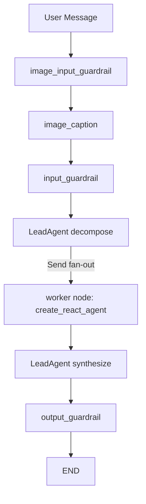

# medix 化改造计划（Swarm Refactor Plan）

> 彻底废除旧体系（LangChain Agent runtime、supervisor 多 Agent 图、单 Agent 图、`prompts/skills` 与 `actions` 间接层），**只保留 langgraph-swarm 一条路径**。Skill 封装与 Agent 自主调用流程完全参考 `medix-agent-swarm`，但用 LangGraph 原生能力实现（`create_react_agent` + `Send` 扇出 + reducer 合并）。

## 1. 目标与原则

- 唯一运行时：`langgraph-swarm`，不再有 `langchain` / `langgraph`(单) / `langgraph-multi`。
- **「去掉 LangChain」的边界**：废除的是旧 **LangChain Agent runtime**（`build_dialog_agent_langchain`、`AgentExecutor`、`initialize_agent` 等），**不是**废除 `langchain_core.tools.StructuredTool`。`create_react_agent` 本身接受 LangChain Core 工具协议，Phase 1 注册表应导出 `StructuredTool` 供 ReAct worker 使用，这与「只保留 langgraph-swarm」不冲突。
- Skill 层结构化：参考 medix `core/skill_registry.py`，自包含函数 + 参数 schema + 注册表，统一导出为 `StructuredTool`（供 ReAct worker）与 OpenAI function schema（供 LeadAgent 决策）。
- Agent 自主选 Skill：三类领域 Agent（咨询/诊断/研究）均注册全部领域 Skill，用 system prompt 引导各自侧重，对齐 medix「Agent 灵活选择」。
- 复杂度路由内聚：由 LeadAgent 的 decompose 决定子任务数，1 个走单 Agent，>=2 个走并行 Swarm，不再有独立 supervisor。
- LangGraph 原生：用 `create_react_agent` 对应 medix 的 AgentLoop，用 `Send` + reducer 对应 medix 的 `SharedContext` + `asyncio.gather`，天然支持 checkpoint/stream。

## 2. 现状 vs 目标

现状关键文件：

- 运行时装配：`src/agents/dialog_agent.py` 的 `build_dialog_runtime()`（langchain / langgraph / langgraph-multi）
- 多 Agent 图（supervisor 选一个专家）：`src/graphs/multi_agent_graph.py`
- 单 Agent 图：`src/graphs/dialog_graph.py`
- Agent 定义：`src/agents/agent_registry.py`（`AgentDef`）
- Skill（prompt + tool 名映射）：`src/prompts/skills/__init__.py`（`SkillDef`）
- 工具：`src/actions/basic_tools.py`、`src/actions/knowledge_base_tools.py`、`src/actions/web_search_tools.py`
- RAG：`src/rag/core/service.py`
- 服务/流式：`src/services/chat_service.py`
- 配置：`src/config/settings.py`

差距与本次取舍：

- Skill 仅是「prompt + tool 名映射」，缺结构化原子函数 + 参数 schema + 注册表 → 新建 `src/skills/`。
- 多 Agent 是「路由选一个专家」，缺「分解 → 并行多 Agent → 汇总」→ 用 LangGraph Swarm 子图替代。
- 缺领域 Agent（咨询/诊断/研究）与领域 Skill（风险/症状/ICD/指南）→ 移植 medix。
- 旧的多运行时与向后兼容不再保留 → 直接删除。

## 3. 目标架构（唯一路径）



- 简单问题：decompose 产出 1 个子任务 → 1 个 worker → synthesize 直通。
- 复杂问题：decompose 产出 >=2 子任务 → `Send` 并行多 worker → synthesize LLM 汇总。

Skill 层映射：每个领域 Skill 是自包含函数（带参数 schema），底层调用现有 `RAGService` / `web_search` / 规则逻辑；注册表统一暴露为 `StructuredTool`（供 ReAct worker）与 OpenAI function schema（供 LeadAgent 决策）。领域 Skill 函数本身为普通 Python 函数，**不再**用 `@tool` 装饰器注册。

## 4. 实施阶段

### Phase 1 文档驱动的 Skill 体系（核心，中）

> **维护方式（关键变更）**：每个 Skill 以 **`SKILL.md` 文档 + `script/` 脚本** 的目录形式维护，完全对齐 `medix-agent-swarm/.claude/skills` 的组织方式；由 loader 自动扫描发现，**不再在 Python 里逐个手写 `register_skill(Skill(...))`**。新增/调整 Skill 只需增删目录与改 md，无需改注册代码。

#### 1.1 目录结构

Skill 文档与脚本集中放在 `src/skills/defs/`，引擎代码放在 `src/skills/` 根：

```text
src/skills/
├── __init__.py        # 首次导入时触发 loader.load_all()，导出便捷函数
├── base.py            # SkillParameter + Skill（已实现）
├── registry.py        # SkillRegistry: register/get/select/to_openai_tools/to_react_tools（已实现）
├── loader.py          # 扫描 defs/，解析 SKILL.md frontmatter，动态加载函数并注册
└── defs/              # 全部 Skill 文档（md 维护）
    ├── search-knowledge/
    │   ├── SKILL.md           # frontmatter: name/description/script/function/parameters
    │   └── script/search.py   # def search_knowledge(query): 包装 get_rag_service().answer()
    ├── disease-code/
    │   ├── SKILL.md
    │   └── script/code.py
    ├── clinical-guideline/
    │   ├── SKILL.md
    │   └── script/guideline.py
    ├── assess-risk/
    │   ├── SKILL.md
    │   └── script/risk.py     # 规则引擎，移植 medix（去 Milvus）
    ├── analyze-symptoms/
    │   ├── SKILL.md
    │   └── script/symptoms.py
    ├── web-search/
    │   ├── SKILL.md
    │   └── script/search.py   # 包装 web_search_tools
    └── deep-research/
        ├── SKILL.md
        └── script/research.py # 本期复用 web_search，Phase 7 升级
```

#### 1.2 SKILL.md 规范（带参数 schema）

在 medix frontmatter（`name` + `description`）基础上扩展 `script` / `function` / `parameters`，让 md 成为单一事实来源，loader 据此生成 OpenAI schema 与 `StructuredTool`：

```markdown
---
name: search_knowledge
description: 检索本地医学知识库，返回答案、来源与调试信息。适用于一般医学知识问答。
script: search
function: search_knowledge
parameters:
  - name: query
    type: string
    description: 医学问题或检索关键词
    required: true
---

# Search Knowledge（知识库检索）

## When to Use
- 用户提出一般医学知识问题
- 需要带来源引用的本地知识库答案

## 底层实现
- 复用 `src/actions/knowledge_base_tools.py` 的 `get_rag_service().answer()`
- service 未初始化时返回 `{"ok": false, "error": "service_not_initialized"}`
```

约定：`name` 用 snake_case（与函数名/工具名一致），目录名用 kebab-case；`parameters` 直接映射 `SkillParameter` 字段。

#### 1.3 loader 与 registry

- `loader.py`：参考 medix `core/skill_loader.py` 的 `parse_skill_md` / `discover_skills`。流程：扫描 `defs/*/SKILL.md` → 解析 frontmatter → 用 `importlib` 从 `script/<script>.py` 加载 `<function>` → 把 `parameters` 转成 `list[SkillParameter]` → 构造 `Skill(...)` → 调 `registry.register(skill)`。解析失败的 skill 记录 warning 并跳过（优雅降级），不影响其它 skill。
- `registry.py`（已实现）：`register/get/select/to_openai_tools/to_react_tools`；`to_react_tools` 用 `StructuredTool.from_function` 供 ReAct worker，`to_openai_tools` 供 LeadAgent 决策。
- `__init__.py`：首次导入时调用 `loader.load_all()` 填充单例 `registry`，并导出 `get_react_tools/get_openai_tools`。
- 依赖：frontmatter 采用 loader 内置的极简解析器（仅支持本项目受控的 SKILL.md 格式），**不引入 `pyyaml`**，避免新增外部依赖。

#### 1.4 领域 Skill（复用现有后端能力，不重造）

- `search_knowledge`：调用 `get_rag_service().answer()`（保留 `set_rag_service/get_rag_service`，仍被 `bootstrap_rag` 使用）。
- `disease_code` / `clinical_guideline`：用定制 query 调 RAGService（现有 RAG 无 medix 的 metadata filter，先按查询词检索 + 优雅降级）。
- `assess_risk` / `analyze_symptoms`：移植 medix `assess-risk`、`analyze-symptoms` 的规则引擎（去掉 Milvus 依赖，KB 增强可选调 `search_knowledge`）。
- `web_search` / `deep_research`：包装 `src/actions/web_search_tools.py` 的 `web_search`；`deep_research` 本期先复用 web_search，Phase 7 升级证据综合。
- 不再保留旧 `prompts/skills` 的 `SkillDef`（prompt + toolname）体系，也不采用「每个模块手写 register」的方式。

### Phase 2 领域 Agent（create_react_agent，中）

- 改写 `src/agents/agent_registry.py`：删除旧 `medical_kb/conversation/web_search`，新增 `consultation/diagnostic/research` 三个 `AgentSpec(name, description, skill_names, system_prompt)`，system_prompt 参考 medix 三个 Agent 的提示词。
- 新增 `src/agents/domain_agents.py`：`build_domain_agents(settings) -> dict[str, Runnable]`，每个 Agent 用 `from langgraph.prebuilt import create_react_agent`，`tools=registry.to_react_tools(spec.skill_names)`，`prompt=spec.system_prompt`。
- LangGraph 自带 ReAct 循环即对应 medix 的 AgentLoop（LLM 自主多轮调用 Skill），无需移植自写 loop。

### Phase 3 Swarm LangGraph 子图（核心，大）

前置抽取（删除旧文件前必须先做）：

- 新增 `src/graphs/common_nodes.py`：迁移 `src/graphs/multi_agent_graph.py` 的 `_build_image_input_guardrail_node`、`_build_image_caption_node`、`_build_input_guardrail_node`、`_build_output_guardrail_node` 及辅助函数。
- 新增 `src/graphs/checkpointer.py`：迁移 `src/graphs/dialog_graph.py` 的 `_build_checkpointer`（Postgres/Memory）。

核心实现：

- `src/graphs/swarm_state.py`：`SwarmState(MessagesState)`，字段含 `subtasks: list`、`contributions: Annotated[list, operator.add]`（reducer 支持并行写入）、`final_answer: str | None`、`subtask: dict | None`（Send 单任务输入）、以及复用的多模态字段 `had_image/attachments/image_captions/blocked`。
- `src/graphs/lead_agent.py`：
  - `decompose_node`：参考 medix `swarm/lead_agent.py` 提示词，LLM 输出 `{"subtasks":[{"description","assigned_agent"}]}`，解析失败回退单个 consultation 子任务。
  - `synthesize_node`：1 条贡献直通；多条用 LLM 汇总，写 `final_answer` 与最终 `AIMessage`。
- `src/graphs/swarm_graph.py`：
  - 节点链：image_input_guardrail → image_caption → input_guardrail → decompose → worker → synthesize → output_guardrail。
  - decompose 后用条件边返回 `[Send("worker", {"subtask": st, "messages": ...}) for st in subtasks]`（`from langgraph.constants import Send`）。
  - worker 节点按 `subtask.assigned_agent` 取对应 react agent，invoke 后返回 `{"contributions":[{agent_id, description, result}]}`。
  - `build_swarm_graph(settings, checkpointer=None)` 编译并返回；guardrail 关闭时跳过对应节点。
- 说明：以「LangGraph 原生 Send + reducer」替代 medix 的 `SharedContext` + `asyncio.gather`，语义等价但天然支持 checkpoint/stream。

### Phase 4 协调器路由（内聚到 decompose，中）

- 删除独立 supervisor。复杂度判定由 `decompose_node` 完成：子任务数 == 1 即单 Agent 路径，>= 2 即并行 Swarm。
- 可选用 `settings.complexity_threshold` / 规则给 LeadAgent 提示，避免过度分解（参考 medix「尽量少分配」原则）。

### Phase 0 配置与运行时入口简化（小）

> 与旧版不同：本次不再新增 `agent_mode` 开关，而是直接把运行时收敛为 swarm 唯一。

- `src/config/settings.py`：移除 `agent_mode`、`agent_runtime` 及 `_parse_runtime` 的读取/分支（并修复当前重复定义的 `agent_mode`），仅保留 Swarm 参数：

```python
swarm_max_workers: int = 3
swarm_timeout_s: float = 90.0
complexity_threshold: float = 0.6
```

- `src/agents/dialog_agent.py`：删除 `build_dialog_agent_langchain` 与 langchain import；`build_dialog_runtime()` 永远返回 `(build_swarm_agent(settings), "langgraph-swarm")`，函数名保留以兼容 `src/main.py`、`src/web/app.py`。

### Phase 5 服务接入与流式（中）

- `src/services/chat_service.py`：`stream_multi` 改为 `_runtime == "langgraph-swarm"` 即 True；节点过滤集合加入 `decompose`/`worker`，最终答案取 `synthesize`/`output_guardrail`；`_KB_GROUNDED_TOOLS` 改为新 skill 名 `{"search_knowledge"}`。
- 验证 CLI `src/main.py` 与 Web `src/web/app.py` 两条链路。

### Phase 6 记忆分层（后续，中）

- 短期：复用现有 LangGraph checkpointer（thread 级）+ 可选 `recent_history` 注入。
- 长期：接入 Mem0（`mem0ai` 依赖 + `MEM0_API_KEY`），新增 `src/memory/long_term.py`（参考 medix `memory/long_term.py`）：会话结束写 summary、开始时检索相似案例注入协调器上下文；Mem0 不可用时优雅降级。

### Phase 7 Harness 护栏 + DeepResearch（后续，中）

- 移植 medix `constraints/validator.py` + `validation/auto_fixer.py` 的核心（免责声明、高危就医提醒），与现有 `agents/guardrails` 融合，避免重复。
- DeepResearch 作为 `research` Agent 的高级 Skill（包装 web_search + RAG + 证据综合）。

## 5. 工作量评估（粗略）

- Phase 0：0.5 人天
- Phase 1（文档驱动 Skill 体系：loader + SKILL.md + 领域脚本）：2–3 人天
- Phase 2（领域 Agent）：1–2 人天
- Phase 3（Swarm 子图，最复杂）：3–4 人天
- Phase 4（协调器路由）：1–2 人天
- Phase 5（服务/流式接入与联调）：1–2 人天
- core 合计约 9–14 人天
- Phase 6（Mem0 记忆）：2–3 人天；Phase 7（Harness + DeepResearch）：2–3 人天

## 6. 风险与缓解

- LangGraph 并行写状态冲突：必须给 `contributions` 加 reducer（`Annotated[list, add]`），否则并行分支互相覆盖。
- 流式渲染重复/乱序：Swarm 多节点产出需在 `src/services/chat_service.py` 用 `stream_multi` 策略只在 `synthesize` 输出最终答案。
- 一次性切换风险：本次彻底废除旧 single/multi/langchain 路径，无回退兜底，需在 Phase 5 联调充分后再删除旧文件（见第 8 节顺序）。
- Mem0 外部依赖与费用：默认禁用，缺 key 时降级为仅短期记忆。

## 7. 验证

- `src/tests/test_swarm_smoke.py`：
  - 简单问题（1 子任务）走单 worker；
  - 复杂问题（>=2 子任务）触发并行 + 汇总；
  - 断言 `contributions` 数与 `final_answer` 非空；
  - 确认不再返回 `langchain` / `langgraph-multi` 运行时。

## 8. 删除清单

> 顺序原则：先抽取公共节点 / checkpointer，跑通 swarm 唯一路径（Phase 0/5），再删除旧文件。

### 8.1 可立即删除（低风险）

临时调试/冒烟脚本与死代码：

- `src/tests/tmp_step1_smoke.py`、`tmp_step2_smoke.py`、`tmp_step3_smoke.py`、`tmp_step4_smoke.py`
- `src/tests/tmp_langgraph_smoke.py`、`tmp_validate_kungpao.py`
- `src/tests/rag/tmp_rerank_diagnose.py`
- `src/actions/knowledge_base_tools.py` 中第 89–132 行已注释掉的旧 `search_knowledge_base` 实现块。

用一个正式的 `src/tests/test_swarm_smoke.py` 取代这些 `tmp_*` 脚本。

### 8.2 完成 Phase 1–2 后删除（旧 Skill/Prompt 体系）

- `src/prompts/system_prompts.py`
- `src/prompts/skills/__init__.py`、`medical_kb.py`、`web_search.py`、`conversation.py`、`time.py`、`calculator.py`
- `src/actions/basic_tools.py`（calculator/time 不再作为工具；如需保留计算/时间，转为 skill）

### 8.3 完成 Phase 0/3/5 后删除（旧图与多运行时）

- `src/graphs/multi_agent_graph.py`（公共节点已迁移到 `common_nodes.py`）
- `src/graphs/dialog_graph.py`（checkpointer 已迁移到 `checkpointer.py`）
- `src/agents/dialog_agent.py` 的 `build_dialog_agent_langchain()` 与 langchain 分支（文件保留但精简）
- `src/config/settings.py` 中 `agent_mode` / `agent_runtime` / `_parse_runtime` 相关取值与分支

### 8.4 疑似未使用，待确认后删除

- `src/memory/session_memory.py`（`ChatSessionMemory`）：会话记忆由 LangGraph checkpointer 承担，删除前全局检索确认无引用。

### 8.5 不建议删除（保留）

- `src/actions/knowledge_base_tools.py`、`src/actions/web_search_tools.py`（作为 skill 后端）
- `src/rag/**`：领域 Skill 的底座。
- `src/agents/guardrails/**`：Phase 7 与 Harness 融合而非删除。
- `src/db/**`、`src/controllers/**`、`src/web/**`：会话存储与服务入口。
- **依赖层面**：`langgraph`、`langchain-core`（`StructuredTool`、`create_react_agent` 所需）保留；仅移除旧 LangChain Agent runtime 相关代码路径，不从 `requirements.txt` 删除 `langchain-core`。Phase 1 loader 用内置极简 frontmatter 解析器，不新增 `pyyaml` 等外部依赖。

### 8.6 清理执行顺序建议

1. 删除 8.1 临时脚本与死代码（立即）。
2. 完成 Phase 1–2 后，删除 8.2 旧 skill/prompt 体系。
3. 完成 Phase 3 前置抽取（common_nodes / checkpointer）与 Phase 0/5 切换后，删除 8.3 旧图与多运行时。
4. 确认后处理 8.4。
5. 每步删除后运行 `test_swarm_smoke.py`，确保单 Agent 与 Swarm 两条路径均通过。
